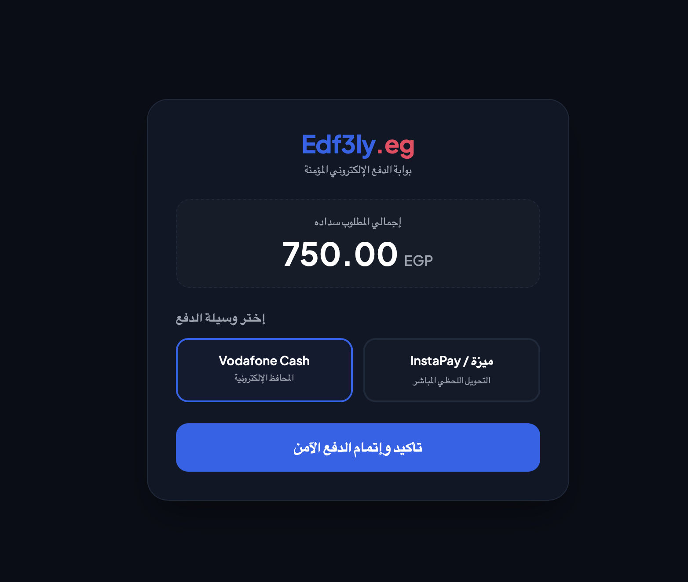
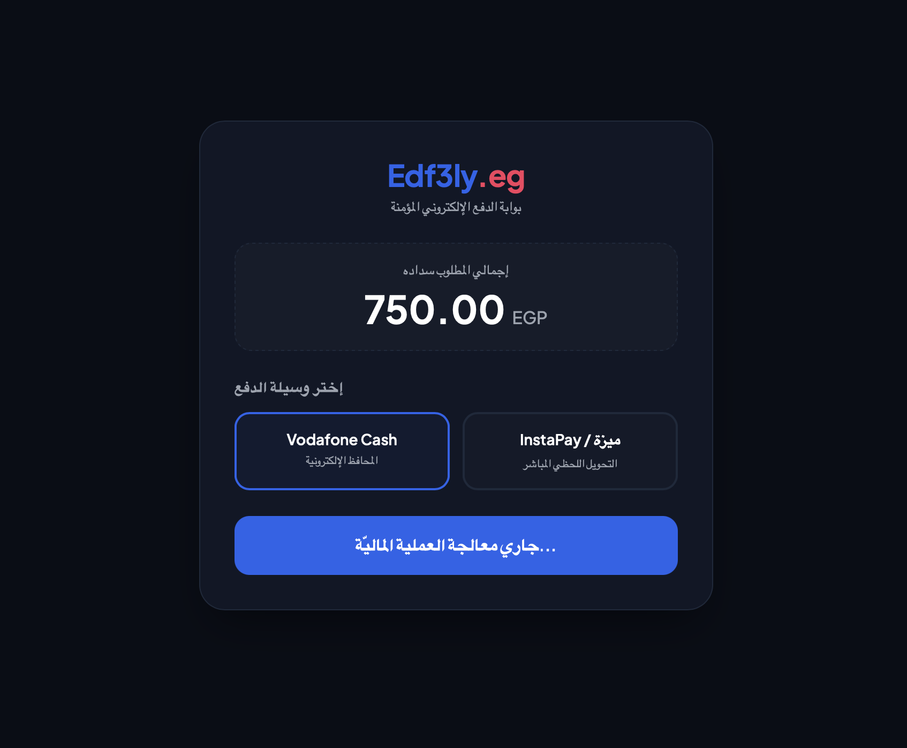
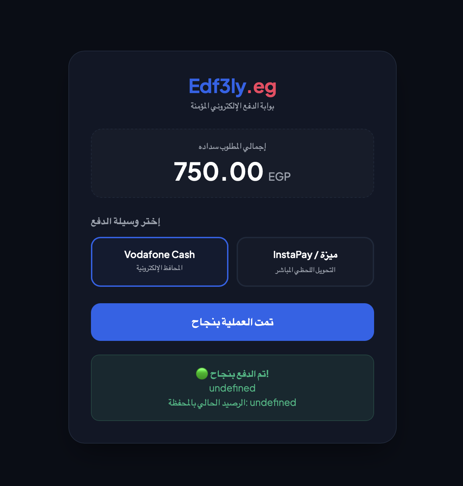

# Edf3ly (إدفع لي) - Hybrid Fintech Payment Gateway

An enterprise-grade, high-concurrency payment gateway infrastructure built with a hybrid microservices architecture using **Laravel 13 (PHP 8.5)** and **Node.js/Express (v26.x) with MongoDB**.

## 📊 Core Payment Dashboard Preview

## 🏛️ System Architecture Layout
- **Laravel Core (`:8000`):** Acts as the central Merchant Control Center, billing dashboard, and invoicing engine.
- **Node.js Gateway (`:5555`):** Acts as the high-throughput, atomic transaction settlement engine optimized for local Egyptian digital wallets (Vodafone Cash, InstaPay, Meeza).
